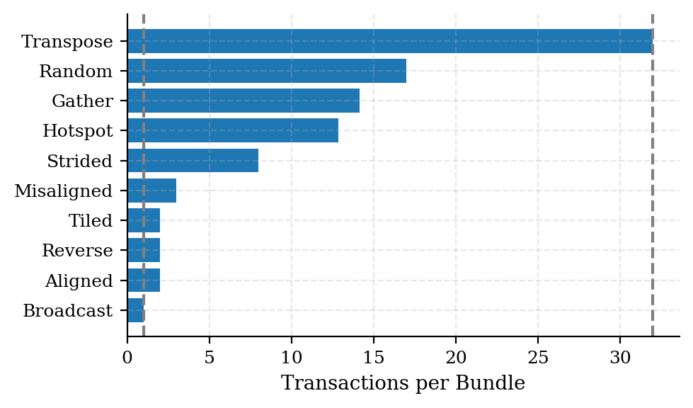
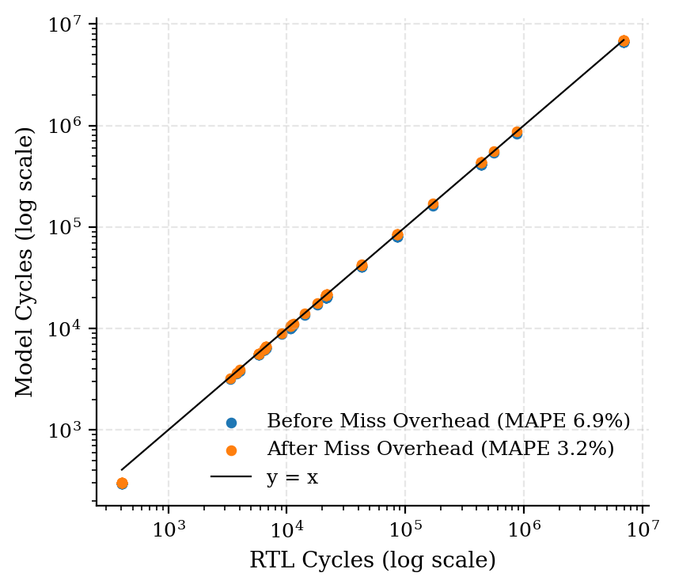
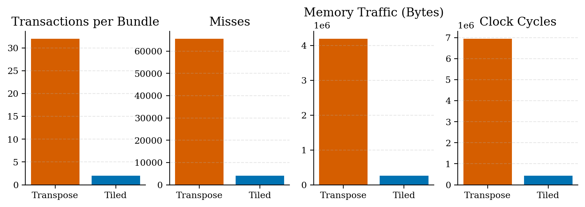
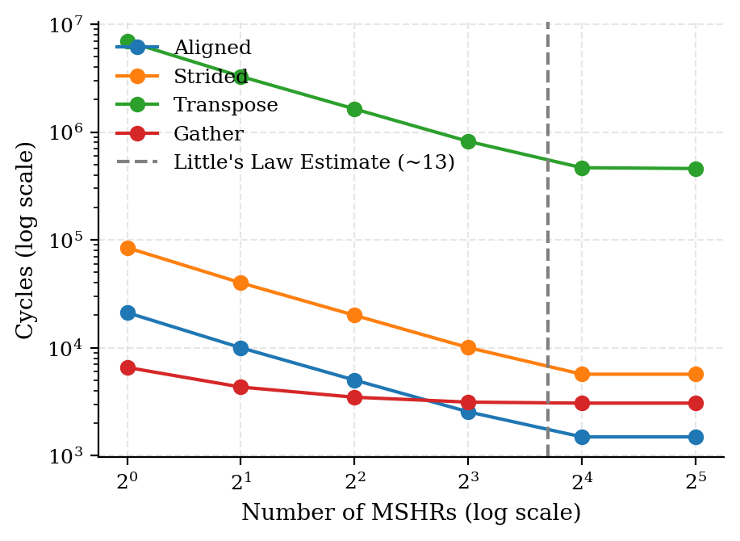
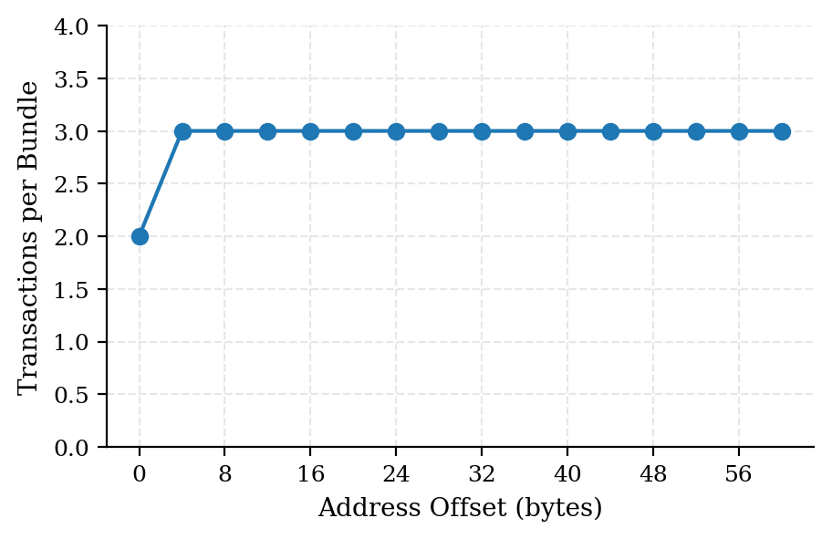
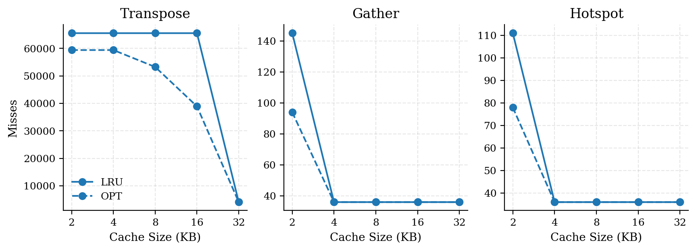

# GPU Memory Coalescer & Cache: RTL with a Cross-Validated Performance Model

This repository contains the design, verification and analysis of a **GPU-style Memory Coalescing Unit and Set-Associative Cache**, implemented twice: once in **SystemVerilog** and once as an independent **C++ Performance Model**. This model also adds **MSHRs** for non-blocking misses, and **Bélády's OPT** (which hardware cannot implement) as a lower bound for LRU.

The two implementations are cross-validated against each other: they agree exactly on every functional counter, and on the order of cache fills (first 2048 are sampled) across **80 configuration-workload runs**, and the model predicts the RTL's cycle count to within **3.2%**. The validated model then runs a 257 point design space sweep in 1.1 seconds, including MSHR configurations that the RTL does not implement.

| | |
|---|---|
|Functional Equivalence| **80/80** configuration x workload runs identical (6 counters + fill order, 610,035 requests)|
|Timing Correlation|**3.2% MAPE**, Spearman ρ =1.00|
|Design-Space Sweep| **257 runs** across 7 experiments in **1.1 seconds** (model only)|
|Assertions|**3 SVA properties** held on every cycle of all 80 runs (**54.6M cycles, 0 failures**)|
|Key Finding| Same 32-lane load: **1-32 transactions** by address pattern alone; tiling cuts traffic by **16x**|  

    

## Design

**RTL** (`rtl/`, SystemVerilog, Verilator 5.032)
- *Coalescer:* iterative matcher, each cycle selects lowest-numbered pending lane as leader and emits one transaction covering every pending lane on the same 64 B line.
- *Cache:* blocking, 4-way set-associative, LRU with invalid-way-first fill; FSM transition from `IDLE → LOOKUP → REFILL → FILL`; per-fill logging for equivalence checking.
- *Memory:* fixed 100 cycle latency (excluding handshake).

**Model** (`model/`, C++17)
- Same coalescer and cache semantics, and includes capabilities hardware does not have, including MSHRs and Bélády's OPT.

## Validation

**Functional.** 80/80 runs exact on requests, hits, misses, evictions, memory requests, memory bytes and fill order.

**Assertions.** Three SystemVerilog assertions run on every clock cycle: at most one hit per lookup, every request counted as exactly one hit or miss, and every miss issues exactly one memory request. They held across all 80 runs. 

**Timing.** Across the same 80 runs, RTL-model = 5×misses + 1×bundles + 2 exactly.
Modelling the 5 cycle miss path overhead reduced the MAPE from 6.9% to 3.2%; the remaining 1 cycle/bundle (due to coalescer handshake) and 2 reset cycles are left unmodelled by design. This model preserves the RTL's ranking of all runs (ρ =1.00).

    

**Defects found through Cross-Validation** ([Log](docs/NOTES.md))

|Side|Defect|Detection|
|---|---|---|
|Model|Lines in flight counted as misses (non-blocking behaviour vs RTL blocking)| Hit/Miss divergence once memory latency matched the RTL|
|RTL|Hit-Way decoding hardcoded for 4 ways| Error at 1 way; silently corrupted LRU state at 8 ways|
|Model|OPT next_use keyed on byte addresses| OPT reported more misses than LRU|

## Results

**Access Pattern Cost:** Access pattern dominates cost. For the same 256×256 matrix, 16×16 tiling instead of column order reduces transactions, memory traffic and cycles required by 16×.

    

**Memory Parallelism saturates at ~16 MSHRs:** When MSHRs double, the cycles halve, then flatten when number of MSHRs reaches 16. With ~100 cycle latency, and one miss issued every ~7.5 cycles, Little's law gives ~13 misses in flight, which means 16 MSHRs cover it and increasing beyond this point has little effect (eg. transpose still gains ~2%).

    

**Misalignment costs Transactions, not necessarily traffic:** Any offset from 4-60 B turns 2 transactions into 3, but misses rise by only 0.5% because the straddled line is reused by the next bundle.

    

**LRU is near optimal until cache is under pressure:** It matches OPT whenever the working set fits, but it incurs up to ~70% more misses when capacity is marginal or sets are oversubscribed (leading to evictions).

    

## Reproduce

**Requirements:** Linux or WSL, Verilator 5.x, g++ (C++17), make, Python 3 configured with matplotlib.

1. **Everything:** `make reproduce` builds both implementations, runs the full cross-validation, computes the timing correlation, runs the sweep and regenerates every figure.
2. **One Configuration:** `make xval` (baseline).
3. **All Configurations:** `make xval_all` prints 8x10 pass/fail grid.
4. **Model Only:** `make sweep` then `make figures`.

| Path | Contents |
|---|---|
|`rtl/`| Coalescer, Cache Controller, Tag Array, LRU, Memory Model, Parameter Package|
|`tb/`|Verilator Testbench|
|`tb/tests/`|Early per-module bring-up testbenches (superseded by cross-validation; not maintained)|
|`model/`|C++ Model, MSHRs, OPT|
|`scripts/`|Equivalence Check, Correlation, Sweep, Plotting|
|`docs/`|Design Spec, Defect Log, Figures|

## Limitations

- The RTL cache is blocking; MSHR results come from the model only.
- Only LRU replacement is implemented (OPT is an analysis bound in the model).
- Workloads are small, so runtime comparisons include start-up overhead (particularly significant for C++ model).
- The RTL is verified in simulation (Verilator) and has not been synthesised.